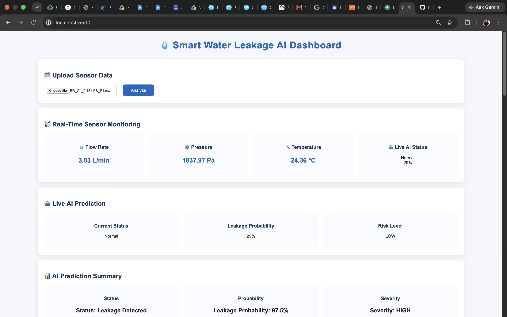

# 💧 Smart Water Leakage AI

An AI-based smart water leakage detection system using Machine Learning, FastAPI, and real-time sensor simulation.

The system analyzes water pipeline sensor signals and detects abnormal patterns to predict possible leakage conditions.

---

## 🚀 Features

- 🤖 Machine Learning based leakage detection
- 📊 Leakage probability prediction
- ⚠️ Leakage severity estimation (LOW / MEDIUM / HIGH)
- 📡 Real-time sensor monitoring simulation
- 🧠 Anomaly detection
- 🚨 Automatic alert generation
- 📈 Sensor signal visualization
- 📜 Prediction history storage
- 🌐 FastAPI backend API
- 🖥️ Interactive dashboard

---

# 🏗️ System Architecture

```
Sensor Data
      |
      ↓
Data Preprocessing
      |
      ↓
Feature Extraction
      |
      ↓
ML Model
      |
      ↓
Leakage Detection
      |
      ↓
FastAPI Backend
      |
      ↓
Web Dashboard
```

---

# 🛠️ Tech Stack

## Backend
- Python
- FastAPI
- SQLite

## Machine Learning
- Scikit-learn
- Random Forest Classifier
- Anomaly Detection

## Frontend
- HTML
- CSS
- JavaScript
- Chart.js

## Future Hardware
- ESP32
- Flow Sensor
- Pressure Sensor

---

# 📂 Project Structure

```
smart-water-leakage-ai/

├── app/
│   └── FastAPI Backend

├── frontend/
│   ├── HTML
│   ├── CSS
│   └── JavaScript

├── ml/
│   └── Machine Learning Pipeline

├── models/
│   └── Trained Models

├── database/
│   └── SQLite Database

├── src/
│   └── Feature Engineering

├── docs/
│   └── Dashboard Screenshot

└── README.md
```

---

# 📸 Dashboard Preview



---

# ⚙️ Installation

Clone repository:

```bash
git clone https://github.com/PradeepChaudhari-ctrl/smart-water-leakage-ai.git
```

Go inside project:

```bash
cd smart-water-leakage-ai
```

Create environment:

```bash
python -m venv venv
```

Activate:

Mac/Linux:

```bash
source venv/bin/activate
```

Install dependencies:

```bash
pip install -r requirements.txt
```

---

# ▶️ Run Backend

Start FastAPI:

```bash
uvicorn app.main:app --reload
```

API:

```
http://127.0.0.1:8000
```

Documentation:

```
http://127.0.0.1:8000/docs
```

---

# 🔮 Future Improvements

- ESP32 hardware integration
- Real sensor deployment
- Cloud monitoring
- Deep Learning based detection
- RAG based AI assistant

---

# 👨‍💻 Author

**Pradeep Chaudhari**

B.Tech CSE (Artificial Intelligence)